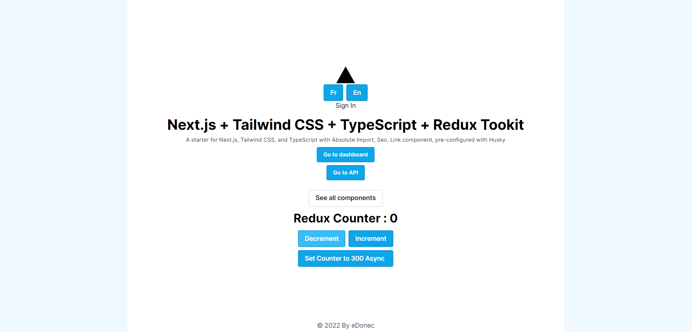

<div  align="center">


<h1>The Ultimate boilerplate</h1>

<p>

A Boilerplate for Microservices NodeJS Architecture

</p>

<!-- Links to be added -->

<!-- <h4>

<a href="https://github.com/Louis3797/awesome-readme-template/">View Demo</a>

<span> · </span>

<a href="https://github.com/Louis3797/awesome-readme-template">Documentation</a>

<span> · </span>

<a href="https://github.com/Louis3797/awesome-readme-template/issues/">Report Bug</a>

<span> · </span>

<a href="https://github.com/Louis3797/awesome-readme-template/issues/">Request Feature</a>

</h4>
-->
</div>

<!-- Table of Contents -->

# :notebook_with_decorative_cover: Table of Contents

- [:notebook_with_decorative_cover: Table of Contents](#notebook_with_decorative_cover-table-of-contents)
  - [:star2: About the Project](#star2-about-the-project)
    - [:camera: Screenshots](#camera-screenshots)
    - [:space_invader: Tech Stack](#space_invader-tech-stack)
    - [:space_invader: Available Microservices](#space_invader-available-microservices)
    - [:dart: Features (so far)](#dart-features-so-far)
    - [:key: Environment Variables](#key-environment-variables)
    - [:key: Environment Variables per project](#key-environment-variables-per-project)
      - [CRA](#cra)
      - [express](#express)
  - [:hammer_and_wrench: Getting Started](#hammer_and_wrench-getting-started)
    - [:bangbang: Prerequisites](#bangbang-prerequisites)
    - [:gear: Installation](#gear-installation)
    - [:gear: Adding dependency to a project](#gear-adding-dependency-to-a-project)
    - [:microscope: Running global Tests](#microscope-running-global-tests)
    - [:microscope: Running project Tests](#microscope-running-project-tests)
    - [:gear: Run Locally](#gear-run-locally)
    - [:inbox_tray: Adding Package to app](#inbox_tray-adding-package-to-app)
    - [:triangular_flag_on_post: Deployment and build](#triangular_flag_on_post-deployment-and-build)
  - [:eyes: Usage](#eyes-usage)
  - [:earth_africa: Roadmap](#earth_africa-roadmap)
  - [:warning: License](#warning-license)
  <!-- About the Project -->

## :star2: About the Project

<!-- Screenshots -->

### :camera: Screenshots

<div  align="center">



</div>

<!-- TechStack -->

### :space_invader: Tech Stack

<details>

<summary>Client</summary>

<ul>

<li><a  href="https://www.typescriptlang.org/">Typescript</a></li>

<li><a  href="https://nextjs.org/">Next.js</a></li>

<li><a  href="https://reactjs.org/">React.js</a></li>

<li><a  href="https://tailwindcss.com/">TailwindCSS</a></li>

</ul>

</details>

<details>

<summary>Server</summary>

<ul>

<li><a  href="https://www.typescriptlang.org/">Typescript</a></li>

<li><a  href="https://expressjs.com/">Express.js</a></li>

<li><a  href="https://socket.io/">SocketIO</a></li>

<li><a  href="https://www.prisma.io/">Mongoose</a></li>

</ul>

</details>

<details>

<summary>MongoDB available Databases per microservice</summary>

<ul>

<li><a  href="https://www.mongodb.com/">auth</a></li>

</ul>

</details>

<details>

<summary>DevOps</summary>

<ul>

<li><a  href="https://www.docker.com/">Docker</a></li>

<li><a  href="https://www.jenkins.io/">Docker compose</a></li>

</ul>

</details>

<!-- Features -->

### :space_invader: Available Microservices

<details>

<summary>Front end</summary>

<ul>

<li><a  href="apps/client/README.md">Client</a></li>

<li><a  href="apps/dashboard/README.md">Dashboard</a></li>

</ul>

</details>

<details>

<summary>Back end</summary>

<ul>

<li> APIs
  <ul>
    <li><a  href="apps/APIs/auth/README.md">auth</a></li>
  </ul>
</li>

<li><a  href="apps/proxy/README.md">proxy</a></li>

</ul>

</details>

<details>

<summary>Packages</summary>

<ul>

<li> node
  <ul>
    <li><a  href="packages/node/config/README.md">api-types</a></li>
    <li><a  href="packages/node/core-utils/README.md">core-utils</a></li>
    <li><a  href="packages/node/custom-error/README.md">custom-error</a></li>
    <li><a  href="packages/node/field-validator/README.md">field-validator</a></li>
    <li><a  href="packages/node/token/README.md">token</a></li>
    <li><a  href="packages/node/shared-types/README.md">shared-types</a></li>
  </ul>
</li>
<li> browser
  <ul>
    <li><a  href="packages/browser/core-hooks/README.md">core-hooks</a></li>
    <li><a  href="packages/browser/core-next-components/README.md">core-next-components</a></li>
    <li><a  href="packages/browser/core-ui/README.md">core-ui</a></li>
    <li><a  href="packages/browser/forms/README.md">forms</a></li>
  </ul>
</li>
<li> SDK/node
    <ul>
      <li><a href='packages/SDK/node/server-sdk/README.md' >server-sdk</a></li>
      <li><a href='packages/SDK/node/auth-sdk/README.md' >auth-sdk</a></li>
    </ul>
<li> SDK/browser
    <ul>
      <li><a href='packages/SDK/browser/.gitkeep' >.gitkeep</a></li>
    </ul>
</li>
<li> config
  <ul>
    <li><a  href="packages/config/config/README.md">config</a></li>
    <li><a  href="packages/config/tsconfig/README.md">tsconfig</a></li>
  </ul>
</li>

</ul>

</details>

<!-- Features -->

### :dart: Features (so far)

- Authentication

  - Role management
  - Token management

- Forms
  - React hook form components
  - Raw form components

<!-- Env Variables -->

### :key: Environment Variables

To run this project, you will need to add the following environment variables to your .env file for every app

`PORT`

### :key: Environment Variables per project

#### CRA

`PORT`

#### express

`PORT`
`DATABASE_URI`
`ACCESS_TOKEN_SECRET_KEY`
`REFRESH_TOKEN_SECRET_KEY`
`TOKEN_EXPIRES_IN`
`REFRESH_TOKEN_EXPIRES_IN`
`NUMBER_OF_AUTH_TRIALS`

<!-- Getting Started -->

## :hammer_and_wrench: Getting Started

<!-- Prerequisites -->

### :bangbang: Prerequisites

This project uses Yarn as package manager

```bash
npm install --global yarn
```

<!-- Installation -->

### :gear: Installation

Install project with yarn

```bash
yarn
```

<!-- Installation -->

### :gear: Adding dependency to a project

Install project with yarn

```bash
yarn workspace <project-name> add [-D] <dependency>
```

<!-- Running Tests -->

### :microscope: Running global Tests

To run tests, run the following command

```bash
yarn test
```

### :microscope: Running project Tests

To run tests, run the following command

```bash
yarn workspace <project> test -watch
```

<!-- Run Locally -->

### :gear: Run Locally

Clone the project

Go to the project directory

Install dependencies

Start the server

```bash
yarn start
```

<!-- Adding Package to app -->

### :inbox_tray: Adding Package to app

To add a package to an app, please follow <a href='readme-assets/add-package.md'>**this guide**</a>.

<!-- Deployment -->

### :triangular_flag_on_post: Deployment and build

Follow this [guide](readme-assets/prebuild-postbuild.md) to build all express projects.

<!-- Usage -->

## :eyes: Usage

Work in progress...

<!-- Roadmap -->

## :earth_africa: Roadmap

Work in progress...

<!-- License -->

## :warning: License

This project is under the strict ownership of Donec no usage of this boilerplate is alowed out of work scope without a written consent. Any usage of this project outside of the allowed parameters will be subject of legal pursuit
