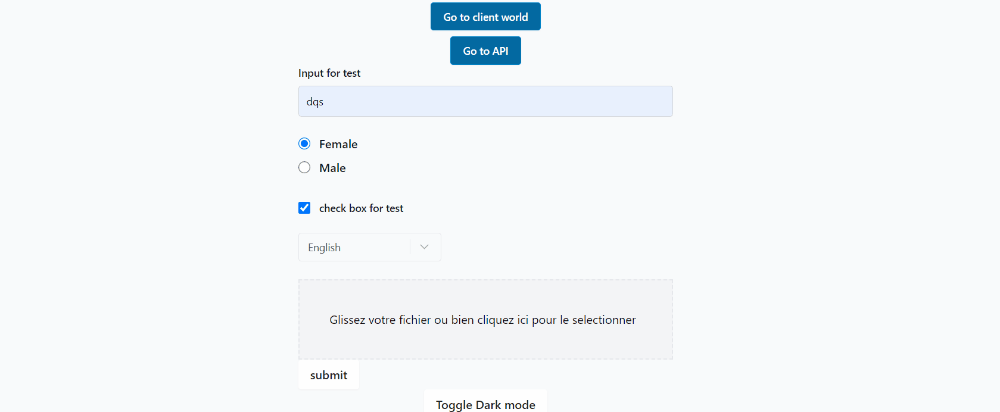

<!-- Alert Dialog -->

# Alert Dialog

<!-- Table of content -->

## Table of content

- [Alert Dialog](#alert-dialog)
  - [Table of content](#table-of-content)
  - [Alert Dialog](#alert-dialog-1)
    - [Import](#import)
    - [Example Usage](#example-usage)
    - [API](#api)
      - [Hook API](#hook-api)
      - [Props](#props)
      - [Hook explanation](#hook-explanation)
    - [Types](#types)
      - [:camera: Screenshots](#camera-screenshots)
  - [:hammer_and_wrench: Getting Started](#hammer_and_wrench-getting-started)
  - [:microscope: Running project Tests](#microscope-running-project-tests)

<!-- AlertDialog -->

## Alert Dialog

<!-- AlertDialog-Import -->

### Import

```typescript
import AlertDialog, { useAlertDialog } from "core-ui/AlertDialog";
```

<!-- AlertDialog-Usage -->

### Example Usage

```typescript
import AlertDialog, { useAlertDialog } from "core-ui/AlertDialog";

const HomePage = () => {
  const onSubmit: SubmitHandler<{ start: string }> = (value) =>
    // eslint-disable-next-line no-console
    console.log(value);
  const [submitModalProps, handleSubmit] = useAlertDialog(onSubmit);

  return (
    <div>
      <AlertDialog
        title="title"
        message="  Never gonna give you up Never gonna let you down Never gonna run
        around and desert you Never gonna make you cry Never gonna say goodbye
        Never gonna tell a lie and hurt you Never gonna give you up Never
        gonna let you down Never gonna run around and desert you Never gonna
        make you cry Never gonna say goodbye Never gonna tell a lie and hurt
        you"
        confirmMessage="Confirmer"
        cancelMessage="Annuler"
        {...submitModalProps}
      />
    </div>
  );
};

export default HomePage;
```

<!-- AlertDialog-API -->

### API

#### Hook API

As paramaters the hook takes a function that will be called when the user clicks on the confirm button.

the hook will later return an array with two elements:

- the first element is an object that contains the props that will be passed to the AlertDialog component containing the management of the opening and closing of the modal.
- the second element is a wrapper function to the submit function that was taken as parameter, this function is a substitute that is the one we need to pass to the form or wherever we need a validation before handling something.

```typescript
const onSubmit: SubmitHandler<{ start: string }> = (value) =>
  // some heavy irreversible logic here
  console.log(value);
const [submitModalProps, handleSubmit] = useAlertDialog(onSubmit);
```

in the above example the function handleSubmit should now be used in the form as a submit function. it will then fire a confirmation alert dialog before executing the heavy irreversible logic.

<!-- AlertDialog-Props -->

#### Props

| Name           | Type       | Description                                                                                                                                                                             | Required |
| -------------- | ---------- | --------------------------------------------------------------------------------------------------------------------------------------------------------------------------------------- | -------- |
| title          | string     | A title for the modal                                                                                                                                                                   | True     |
| message        | string     | The body of the modal or the alert message                                                                                                                                              | True     |
| confirmMessage | string     | A message that will be displayd on the confirmation button of the modal                                                                                                                 | True     |
| cancelMessage  | string     | A message that will be displayd on the cancle button of the modal                                                                                                                       | True     |
| isOpen         | boolean    | a boolean state that when set to true opens the modal, closes elsewhere.                                                                                                                | True     |
| handleClose    | function() | A callback funciton that will fire from inside the component when it should close (for the user to handle the changin of the isOpen variable on this callback's call)                   | True     |
| onSubmit       | function() | it **MUST** be a submit function that is retrieved from the useAlertDialog hook and that **wraps the actual submit function that you need to call** when the confirm button is clicked. | True     |

#### Hook explanation

useAlertDialog:

First function

```typescript
 handleSubmit(submitionArgs:T)=>void
```

Open the modal and submit the arguments in it.

Second function

```typescript
 handleSuccess()=>void
```

Which close the modal if the arguments were submited.

We also added a new prop on modalProps:

```typescript
 onsubmit:handleSuccess,
```

Finally

```typescript
 return [modalProps, handleSubmit],
```

<!--  AlertDialogProps-Types -->

### Types

`TRule` : refer to <a href='../../../node/field-validator/README.md'>**this guide**</a>.

<!-- AlertDialog-Screenshots -->

#### :camera: Screenshots

<div  align="center">



</div>

<!--  Getting Started -->

## :hammer_and_wrench: Getting Started

To add a package to an app, please follow <a href='../../../readme-assets/add-package.md'>**this guide**</a>.

<!--  Running project Tests -->

## :microscope: Running project Tests

To run tests, run the following command

```bash
yarn workspace core-ui test -watch
```
