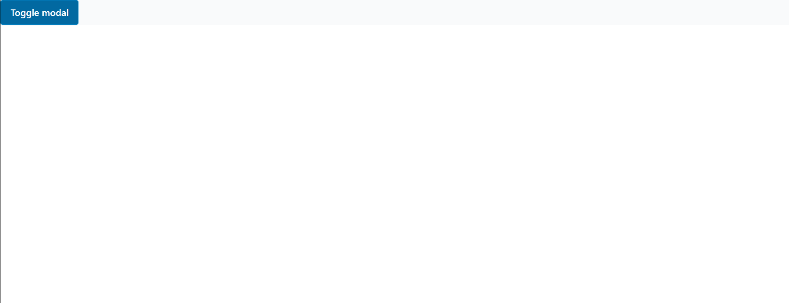

<!-- Modal -->

# Modal

<!-- Table of content -->

## Table of content

- [Modal](#modal)
  - [Table of content](#table-of-content)
  - [Modal](#modal-1)
    - [Import](#import)
    - [Example Usage](#example-usage)
    - [API](#api)
      - [Props](#props)
    - [:camera: Screenshots](#camera-screenshots)
  - [:hammer_and_wrench: Getting Started](#hammer_and_wrench-getting-started)
  - [:microscope: Running project Tests](#microscope-running-project-tests)

## Modal

<!-- Modal-Import -->

### Import

```typescript
import Modal from "core-ui/Modal";
```

<!-- Modal-Usage -->

### Example Usage

```typescript
import { useState } from "react";

import { Button } from "core-ui";
import Modal from "core-ui/Modal";

const HomePage = () => {
  const [open, setOpen] = useState(false);

  return (
    <div>
      <Button onClick={() => setOpen(true)}>Toggle modal</Button>
      <Modal isOpen={open} handleClose={() => setOpen(false)}>
        <p>
          Never gonna give you up Never gonna let you down Never gonna run
          around and desert you Never gonna make you cry Never gonna say goodbye
          Never gonna tell a lie and hurt you Never gonna give you up Never
          gonna let you down Never gonna run around and desert you Never gonna
          make you cry Never gonna say goodbye Never gonna tell a lie and hurt
          you
        </p>
      </Modal>
    </div>
  );
};

export default HomePage;
```

<!-- Modal-API -->

### API

<!-- Modal-Props -->

#### Props

| Name                 | Type       | Description                                                              | Default   | Required |
| -------------------- | ---------- | ------------------------------------------------------------------------ | --------- | -------- |
| isOpen               | boolean    | Open and close the Modal .                                               | undefined | True     |
| lazyMount            | boolean    | Mounts the childComponents only after the first change of isOpen to true | True      | False    |
| shouldUnmountOnClose | boolean    | Unmounts the child components when isOpen is false                       | False     | True     |
| handleClose          | function() | fired when the Modal is opening.                                         | undefined | True     |

<!--  ModalProps-Types -->

<!-- Modal-Screenshots -->

### :camera: Screenshots

<div  align="center">



</div>

<!--  Getting Started -->

## :hammer_and_wrench: Getting Started

To add a package to an app, please follow <a href='../../../readme-assets/add-package.md'>**this guide**</a>.

<!--  Running project Tests -->

## :microscope: Running project Tests

To run tests, run the following command

```bash
yarn workspace core-ui test -watch
```
