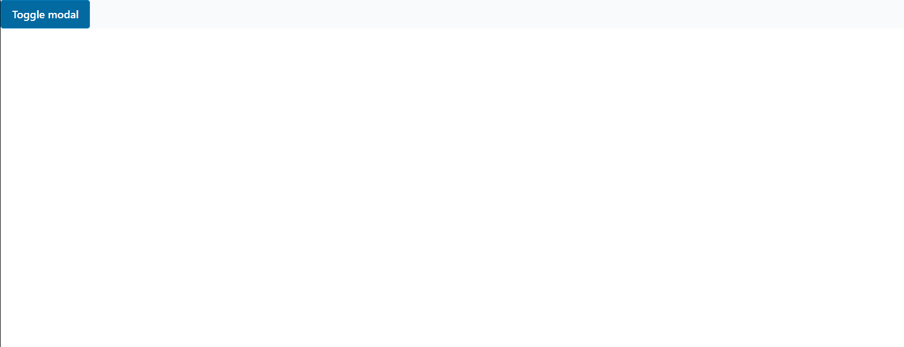

<!-- core-ui -->

# core-ui

<!-- Modal -->

## Modal

#### Import

```typescript
import Modal from "core-ui/Modal";
```

<!-- RawSelect-Usage -->

#### Example Usage

```typescript
import ReactChildrenProps from "shared-types/ReactChildren";

export interface ModalProps extends ReactChildrenProps {
  isOpen: boolean;
  handleClose: () => void;
}
export const Modal: React.FC<ModalProps> = ({
  isOpen,
  handleClose,
  children,
}) => (
  <div>
    <div className={`fixed inset-36 ${isOpen ? "" : "pointer-events-none"}`}>
      <div onClick={handleClose} />
      <div
        className={` "pointer-events-none": !isOpen } 
        ${isOpen ? "opacity-100" : "  opacity-0"}
         relative mx-auto w-full max-w-3xl rounded-lg border-0 bg-white shadow-lg  `}
      >
        <div className="my-4 mx-3  p-5 text-lg leading-relaxed">{children}</div>
        <button type="button" onClick={handleClose}>
          Close
        </button>
      </div>
    </div>
  </div>
);
export default Modal;
```

<!-- RawSelect-API -->

#### API

<!-- RawSelect-Props -->

##### Props

| Name        | Type       | Description                      | Required |
| ----------- | ---------- | -------------------------------- | -------- |
| isOpen      | boolean    | Open and close the Modal .       | True     |
| handleClose | function() | fired when the Modal is opening. | True     |

<!--  SelectProps-Types -->

### Types

`TRule` : refer to <a href='../../node/field-validator/README.md'>**this guide**</a>.

<!-- Screenshots -->

#### :camera: Screenshots

<div  align="center">



</div>

## :hammer_and_wrench: Getting Started

To add a package to an app, please follow <a href='../../../readme-assets/add-package.md'>**this guide**</a>.

<!--  Running project Tests -->

## :microscope: Running project Tests

To run tests, run the following command

```bash
yarn workspace forms test -watch
```

<!-- Getting Started -->
