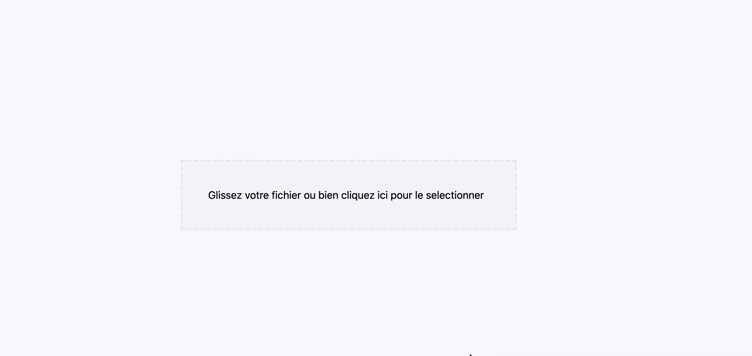

## FilePicker

- [FilePicker](#filepicker)
  - [RawFilePicker](#rawfilepicker)
    - [Import](#import)
    - [Example Usage](#example-usage)
      - [Props](#props)
  - [Props: Dropzone](#props-dropzone)
  - [FilePicker](#filepicker-1)
    - [Import](#import-1)
    - [Example Usage](#example-usage-1)
      - [Props](#props-1)
    - [Screenshots](#screenshots)
    <!-- RawFilePicker -->

### RawFilePicker

<!-- RawFilePicker-Import -->

#### Import

```typescript
import { RawFilePicker } from "forms";
```

#### Example Usage

```typescript
import { RawFilePicker } from "forms";

const FilePicker = () => (
  <RawFilePicker
    name="image"
    label="Click to select file"
    accept=".jpeg,.jpg,.docx,.pdf"
    maxFiles={2}
  ></RawFilePicker>;
);

export default FilePicker;
```

##### Props

| Name     | Type                             | Description                                  | Required |
| -------- | -------------------------------- | -------------------------------------------- | -------- |
| name     | string                           | Form field name                              | True     |
| label    | string                           | the form picker label.                       | False    |
| error    | string                           | Shows an error message if truthy             | False    |
| maxFiles | number                           | Maximum accepted number of files             | False    |
| onChange | files: IFileWithPreview) => void | Fired when the files inside dropzone change. | False    |
| accept   | string, string[]                 | Set accepted file types                      | False    |
| value    | string, string[]                 | the value of upload file                     | False    |

### Props: Dropzone

| Name          | Type     | Description                                                               | Required |
| ------------- | -------- | ------------------------------------------------------------------------- | -------- |
| getInputProps | function | Returns the props you should apply to hidden file input you render        | False    |
| getRootProps  | function | tReturns the props you should apply to the root drop container you render | False    |
| isDragActive  | boolean  | Active drag is in progress                                                | False    |
| isDragReject  | number   | Some dragged files are rejected                                           | False    |
| onDrop        | function | Callback for when the drop event occurs.                                  | False    |

### FilePicker

<!-- filePicker-import -->

#### Import

```typescript
import FilePicker from "forms/FilePicker";
```

<!--  filePicker-Usage -->

#### Example Usage

```typescript
import FilePicker from "forms/FilePicker";

const HomePage = () => {
  return (
    <FormProvider {...methods}>
      <form onSubmit={methods.handleSubmit(onSubmit)}>
        <FilePicker
          name="image"
          label="Click to select image"
          accept=".jpeg,.jpg,.png,.docx,.pptx,.pdf,.xlsx"
          maxFiles={10}
        ></FilePicker>
        <Button type="submit" light>
          submit
        </Button>
      </form>
    </FormProvider>
  );
};

export default HomePage;
```

##### Props

| Name     | Type   | Description                      | Required |
| -------- | ------ | -------------------------------- | -------- |
| name     | string | Form field name                  | True     |
| label    | string | the form picker label.           | False    |
| maxFiles | number | Maximum accepted number of files | False    |
| accept   | string | Set accepted file types          | False    |

#### Screenshots



</div>
